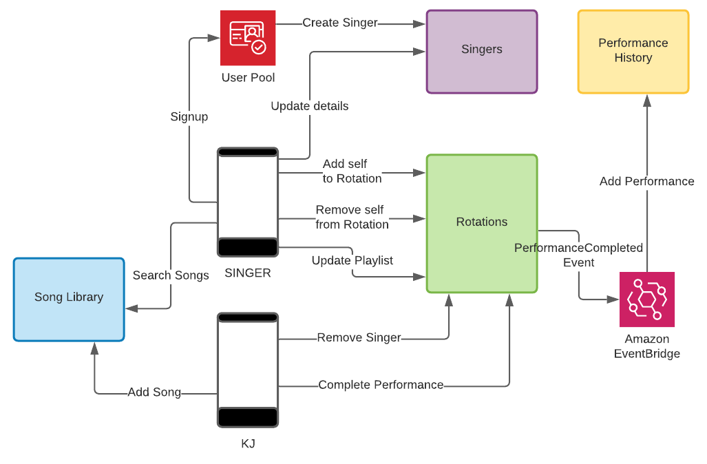

# Karaoke Backend

This is a demo project that I have been working on as a way to wrap my head around building a backend using AWS serverless services and [Serverless Stack (sst)](https://serverless-stack.com). The app is written in Typescript and is composed of [Four Microservices](#microservices).

 

Core AWS Services

- The resources are provisioned with an Infrastructure as Code approach using **[sst](https://serverless-stack.com/)**.
- The backbone of karaoke backend is **API Gateway**, **Lambda**, and **DynamoDB**. Each microservice is encapsulated by one API.
- Sign-up and sign-in are managed by **Amazon Cognito**.
- **EventBridge** is used to decouple communication between microservices.
- **SNS**: I haven't yet implemented anything with this service. Ultimately, SNS will be used for features such as welcoming new singers when they sign up for the app and notifying them as their turn to sing approaches.

### Architectural Overview

## Microservices

(Each microservice has it's own detailed diagram and description)

### [Singers](src/services/singers)

This is, for the most part, a basic "CRUD" microservice. Singers are created by the post-confirmation Cognito trigger when users sign up, rather than a POST endpoint.

### [Song Library](src/services/song-library)

This microservice is still just a CRUD service. Eventually, it will coordinate with uploading song media to S3 with media streaming ability.

### [Rotations](src/services/rotations)

Rotations is going to be the core, functional, and therefore, the most feature-rich of the microservices. Singers will be able to queue themselves to sing, create a playlist for the evening's event, and view singers that are ahead of them in the rotation. KJs will also be able to manage rotations from their end.

### [Performance History](src/services/performance-history)

This small microservice is fundamentally an event log. A performance is logged when a singer completes a performance. A singer and the KJ are able to view a the singer's performance history.

## Security (Sign-Up, Sign-on)

I haven't done much in this area yet. The app currently uses Cognito for signing up. This is key, because a Singer needs to be created upon confirmation of signup with the same UUID in the singers table as exists for the user in the Cognito user pool, which is what I have implemented so far. I've been reading about some limitations of Cognito, and that it takes several Cognito trigger Lambdas to make for a full-featured security experience. I will beef out this area of functionality once I have explored integrating a SAML identity service, such as Auth0.
