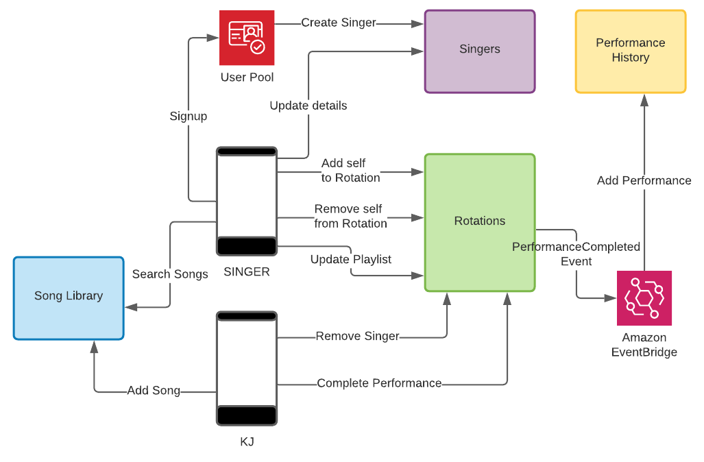

# Karaoke Backend

_(Last Updated: August 30, 2021)_

This is a demo project that I have been working on as a way to wrap my head around building a backend using AWS serverless services and [Serverless Stack (sst)](https://serverless-stack.com). I chose Serverless Stack over the Serverless framework because:

- I think it does a better job of thinking cloud-natively. Cloud services weren't designed to be run locally. Forcing serverless applications to follow the old development paradigm of locally installing databases and other infrastructure for smoke testing has been a pain point for me.
- I love [Live Lambda](https://docs.serverless-stack.com/live-lambda-development). API Gateway, DynamoDB and other infrastructure run in the cloud, while pointing to my local Lambda code so that I can smoke test before deploying.
- No more YAML! No more plugins! It has really been a pleasure defining infrastructure with cdk in the same repository as the application code. I find it to be frustration-free, and pleasurable in the way that I enjoyed playing with Legos as a kid.

The app is written in Python and Typescript and is composed of [Four Microservices](#microservices). CDK code for specifying infrastructure is written in Typescript, while the Lambdas and other application code, and unit and integration tests are written in Python. I personally prefer Python over Node, and look forward to sst releasing their fully Python product soon!

## Instructions

If you'd like to try your hand at playing around with Karaoke Backend, [these instructions](site/instructions.md) detail how to run locally with Live Lambda, deploy to your AWS account, and how to take the unit and integration tests for a test drive.

### Core AWS Services

- The resources are provisioned with an Infrastructure as Code approach using **[sst](https://serverless-stack.com/)**.
- The backbone of karaoke backend is **API Gateway**, **Lambda**, and **DynamoDB**. Each microservice is encapsulated by one API.
- Sign-up and sign-in are managed by **Amazon Cognito**.
- **EventBridge** is used to decouple communication between microservices.
- **SQS**: I'm about to use a fair amount of SQS in the Rotations microservice to decouple multiple Lambdas invocations per API Gateway call.
- **SNS**: I haven't yet implemented anything with this service. Ultimately, SNS will be used for features such as welcoming new singers when they sign up for the app and notifying them as their turn to sing approaches.

### Architectural Overview

## Microservices

(Each microservice has it's own detailed diagram and description)

### [Singers](site/singers.md)

This is, for the most part, a basic "CRUD" microservice. Singers are created by the post-confirmation Cognito trigger when users sign up, rather than a POST endpoint.

### [Song Library](site/song-library.md)

This microservice is still just a CRUD service. Eventually, it will coordinate with uploading song media to S3 with media streaming ability.

### [Rotations](site/rotations.md)

While still very much under construction, this microservice is turning out to be the most interesting of the four.

### [Performance History](site/performance-history.md)

This small microservice is fundamentally an event log. A performance is logged when a singer completes a performance. A singer and the KJ are able to view a the singer's performance history.

## CI/CD

Click [here](site/cicd.md) for an explanation of my CI/CD approach, how I manage resources in the test environment vs the dev and prod environments, and how

## Security (Sign-Up, Sign-On)

I haven't done much in this area yet. The app currently uses Cognito for signing up. This is key, because a Singer needs to be created upon confirmation of signup with the same UUID in the singers table as exists for the user in the Cognito user pool, which is what I have implemented so far. I've been reading about some limitations of Cognito, and that it takes several Cognito trigger Lambdas to make for a full-featured security experience. I will beef out this area of functionality once I have explored integrating a SAML identity service, such as Auth0.

## Companion Projects

This project has been an adventure in learning how to develop serverless applications with AWS services. Along the way, I have conducted several spikes to experiment with sst and AWS services before implementing these approaches in Karaoke Backend.

- [serverless-sst-spikes](https://github.com/lukewyman/serverless-sst-spikes) - a collection of spikes for implementing AWS services with Serverless Stack.
- [lambda-deploy-spikes](x) - a collection of spikes that work progressively through various Lambda deployment strategies, starting with raw deployment as a zip file or docker image, working through the same with sst. Ultimately, I'd like to experiment with Lambda Layers, too.
