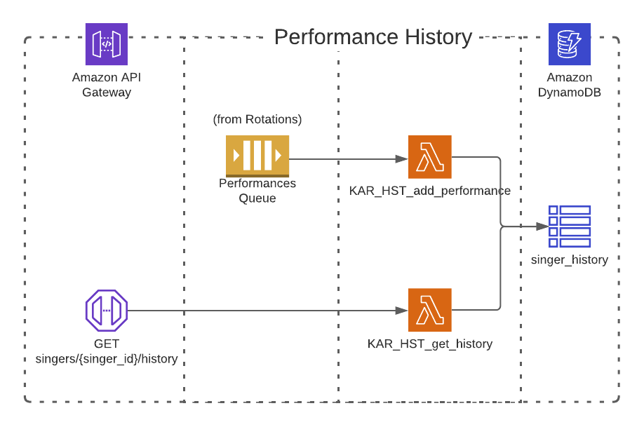

## Performance History Microservice

This simple microservice is fundamentally an event log. `PerformanceCompleted` events are put on the Event Bus by the [Rotations](../rotations) microservice whenever a singer has finished singing:

- Lambda `KAR_HST_add_performance.handler` receives a `PerformanceCompleted` event.
- The `PerformanceCompleted` event is converted to a `Performance` domain object and saved to the DynamoDB table
- A singer's performance history can get retreived from `GET /karaoke/performances/singer/{singerId}` and is returned in descending order of `PerformanceDate`.
