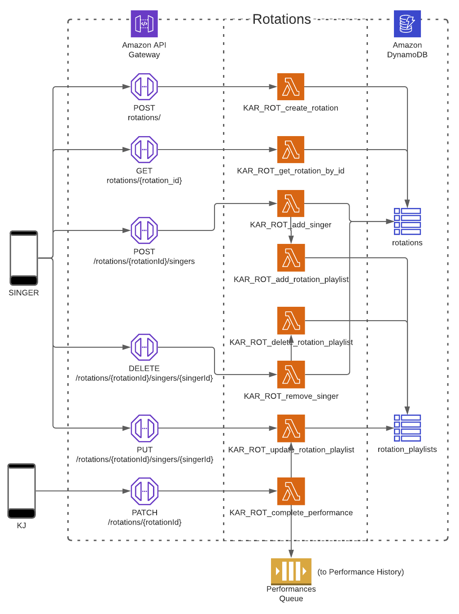

## Rotations Microservice

Currently, this microservice is a simple test harness for the Event Bus:

- An `AddPerformance` DTO is POSTed to `karaoke/rotations/performances`.
- Lambda function `KAR_ROT_complete_performance.handler` puts a `PerformanceCompleted` event to the Event Bus.
- The [Performance History](../performance-history) microservice receives the event from the Event Bus for processing.
